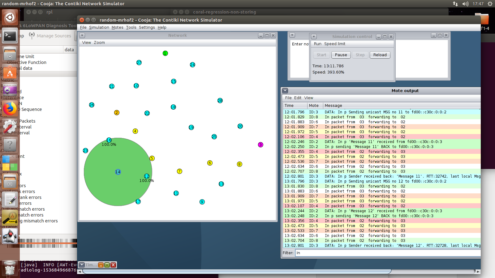

# rpl_link_coloring

In this project, the RPL Link Coloring is used with a new Objective Function to support peer-to-peer communication, since RPL cannot do this efficiently.
The basic idea is to create a DODAG which will support the direct communication of two any nodes in the network, and on the same time bring the least disturbance to the rest.

Notice in the cooja screenshot above that there are four (4) different sets of nodes: white -non participating to p2p, purple-sender, red-participating to p2p nodes, and orange (No 2) which is the receiver. By using the standard MRHOF the communication between nodes 3-->2 is unreliable and ofter fails. As soon as the new MRHOF2 is activated, the communication between them is highly improved. Nodes "below" the yellow ones (remember the yellow are colored "red" in the MRHOF2) are experiencing a worsening intho their communication with the sink since now the path to the sink is becoming "bigger".
You need to experience with the code of the participating nodes which can very easily send upd packets to any destination with any frequency.  The mode output offers many details, from UPD packets send/received, to all kind of icmp packets and statistics.

How to use this directory:
You can download the contiki github, https://github.com/contiki-os/contiki and replace the contiki/core/net/rpl folder with the folder rpl found here. 
You can find cooja ready experiments/simulations for both storing and non-storing modes. 
The basic nodes are: a sink (udp-server), a static client (udp-client-static) and a mobile client (udp-client-mobile). The same clients support different link colors (LC) as defined in the RFC 6551.  

Inside the rpl folder, there is an alteration of contiki/rpl to support link color:
Add the directory rpl into contiki/core/net/rpl and substitute the original. You now have:
Three (3) objective functions instead of two. 
The new one is MRHOF2. It is the same like the original MRHOF, but, the basic function best_parent() is altered:
The basic idea is that if any parent is red color, it is to be chosen, regardless the rank. If both or none parent is red, 
then etx is calculated as a metric.
To choose this new OF, you should declare it inside the project-conf.h
#ifndef RPL_CONF_OF_OCP
#define RPL_CONF_OF_OCP RPL_OCP_MRHOF2 // original is RPL_OCP_MRHOF
#endif

Other minor alterations exist in many files. They all have the comment //George at the beggining.
Remember that Link Color (LC) is mentioned in IANA, but not implemented by default.

Changes in rpl-conf.h
#define RPL_SUPPORTED_OFS {&rpl_of0, &rpl_mrhof, &rpl_mrhof2, &rpl_mrhof10}

Combine this new RPL with the code in the folder coral-rpl-udp-of which has three (3) different types of nodes inside:
a server sink, a mobile node, and a static node. If you alter the color of a family of nodes (node_color = RPL_DAG_MC_LC_RED) those nodes should be prefered as parents. There are more colors in rpl.h, alter them as needed.
#define RPL_DAG_MC_LC_WHITE  0
#define RPL_DAG_MC_LC_BROWN  1
#define RPL_DAG_MC_LC_GREEN  2
#define RPL_DAG_MC_LC_YELLOW 3
#define RPL_DAG_MC_LC_BLACK  4
#define RPL_DAG_MC_LC_RED    5

uint16_t node_color;  is defined also in rpl.h

Remember that enabling the Metric Container MC, and definining as Link color (LC) is more elegant to do it inside the specific project settings, i.e. in project-conf.h, as 
#ifndef RPL_CONF_WITH_MC
#define RPL_CONF_WITH_MC 1 // Enable MC
#endif 

#ifndef RPL_CONF_DAG_MC
#define RPL_CONF_DAG_MC RPL_DAG_MC_LC // Enable MC
#endif 

The demo paper describing the CORAL console used to run the above, can be found in https://youtu.be/_2QHdlCCfzk 
The first paper implementing some of the above was presented in Globecom 2017. It can be found in https://bit.ly/2CWfbEG. 

An early version of the paper implementing this can be found here.
